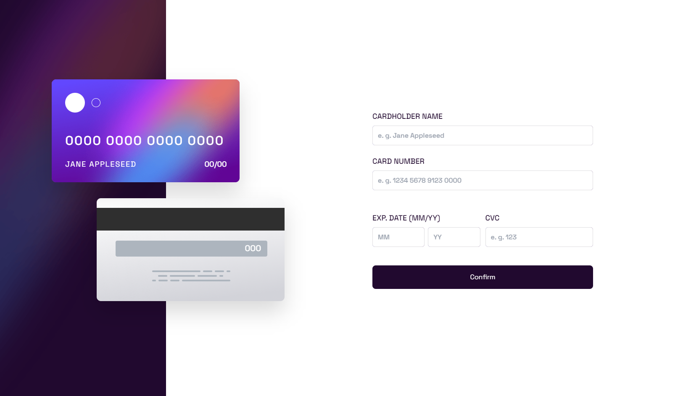

# Interactive card details form solution

This is a solution to the [Interactive card details form challenge on Frontend Mentor](https://www.frontendmentor.io/challenges/interactive-card-details-form-XpS8cKZDWw).

## Table of contents

- [Overview](#overview)
    - [The challenge](#the-challenge)
    - [Screenshot](#screenshot)
    - [Links](#links)
- [My process](#my-process)
  - [What I learned](#what-i-learned)
  - [Built with](#built-with)
  - [Useful resources](#useful-resources)
  - [Author](#author)

## Overview

### The challenge

Users should be able to:

- Fill in the form and see the card details update in real-time
- Receive error messages when the form is submitted if:
    - Any input field is empty
    - The card number, expiry date, or CVC fields are in the wrong format
- View the optimal layout depending on their device's screen size
- See hover, active, and focus states for interactive elements on the page

### Screenshot




### Links

- Live Site URL: [Add live site URL here](https://your-live-site-url.com)

## My process

### What I learned

Working on this challenge i struggled with gradient border for input field, after some research i found suitable for me solution. Wrapping input element in div, which has ::before decoration with gradient fill in it.

```html
<div class="input-border">
  <input placeholder="e. g. Jane Appleseed" required>
</div>
```
```css
.input-border{
  @apply container relative w-full rounded-md;
}

.input-border::before{
  content: "";
  @apply absolute top-0 bottom-0 left-0 right-0 bg-white border-0 rounded-[0.43em];
  top: 0; right: 0; bottom: 0; left: 0;
  z-index: -1;
  background: linear-gradient(to right, #6448FEFF, #600594FF);
}

input{
  @apply w-full h-full bg-white border-solid border-1 border-light-violet rounded-md
  p-3 font-sans font-medium outline-none;
}

input:focus-visible{
  @apply border-none rounded-md;
  background-origin: border-box;
  background-clip: content-box, border-box;
  box-shadow: 2px 1000px 1px #fff inset;
  border: solid 1px transparent;
}
```

### Built with

- Semantic HTML5 markup
- CSS custom properties
- Flexbox
- CSS Grid
- Mobile-first workflow
- [VUE](https://vuejs.org/) - VUE framework
- [Styled Components](https://tailwindcss.ru/) - For styles

### Useful resources

- [Google Fonts](https://fonts.google.com/)
- [Button with gradient border](https://codepen.io/miraviolet/pen/ZobWEg)

## Author

- Frontend Mentor - [@IlyaChichkov](https://www.frontendmentor.io/profile/IlyaChichkov)